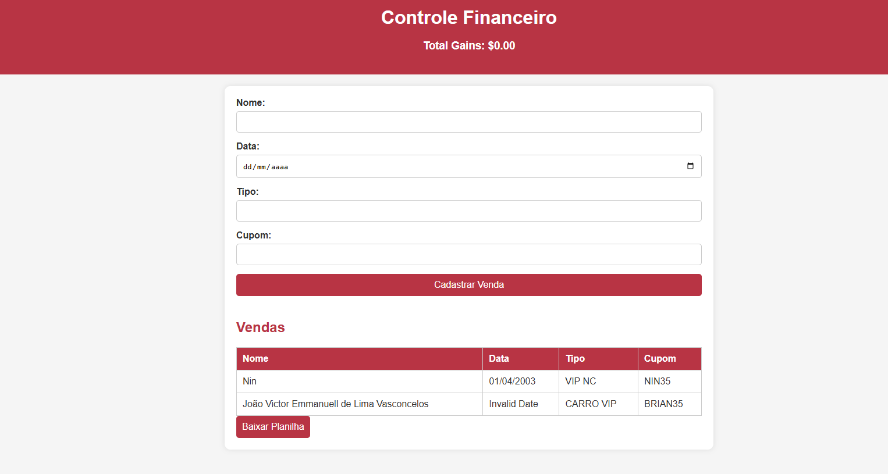

<p align="center">
  <a href="" rel="noopener">
 </a>
</p>

<h3 align="center">Finance Control</h3>

<div align="center">

[]()

</div>

---

<p align="center"> Projeto Feito Para controle de vendas de VIPS e Carros
    <br> 
</p>


## 🧐 About <a name = "about"></a>

Projeto basico feito em JavaScript, utilizando Firebase para armazenamento de dados.

## 🏁 Começando <a name = "getting_started"></a>

Estas instruções fornecerão uma cópia do projeto em funcionamento em sua máquina local para fins de desenvolvimento e teste. Consulte [implantação](#deployment) para obter notas sobre como implantar o projeto em um sistema ativo.


### Intalação

Para rodar o projeto você vai ter que criar um arquivo .env com suas credenciais do firebase. 
 
 E o projeto no firebase

Instale as dependências necessárias:

```
npm install
```

Após configure o Server.js com suas credenciais do FireBase

```
Por ultimo, crie um Realtime DataBase para o seu banco de dados
```


## ⛏️ Built Using <a name = "built_using"></a>

- [FireBase](https://firebase.google.com/) - Database
- [Express](https://expressjs.com/) - Server Framework
- [NodeJs](https://nodejs.org/en/) - Server Environment

## ✍️ Authors <a name = "authors"></a>

- [@Ninzinhu](https://github.com/ninzinhu) - Ideia e Desenvolvimento


